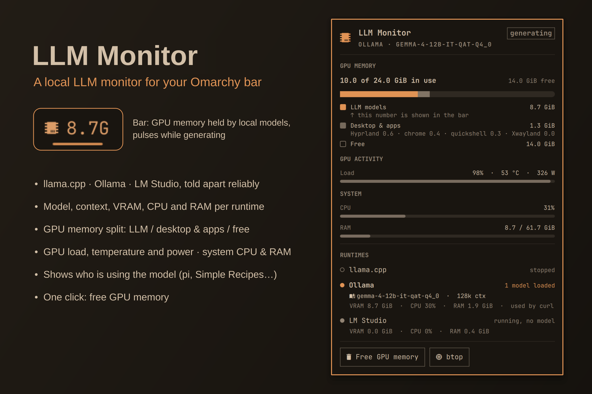

# LLM Monitor



**See at a glance when a local LLM is using your GPU, how much it holds, how full its context is, and who is using it.**

LLM Monitor is a small Omarchy bar widget for people who run local models with **llama.cpp**, **Ollama**, **LM Studio** or **vLLM**.

- **Bar indicator:** a chip icon. Dim while no model is loaded. While a model is resident it shows the GPU memory held by local models and how full the model's context is (e.g. `󰘚 18.0G 33%`), with a thin fill line underneath. It pulses while the GPU is generating. A `!` marks model memory that no longer fits in VRAM and was moved to system RAM.
- **Context colours:** the chip, its fill line and the panel's buffer bars turn **green** (below 50 %), **yellow** (50 %), **orange** (75 %) and **red** (90 %) as the context fills up, using the named colours of your current Omarchy theme. After your coding agent compacts the conversation, the level drops back with its next request.
- **Detail panel (left click):**
  - **GPU memory** as one stacked bar with a legend: *LLM models* (the number in the bar), *Desktop & apps* (with the programs behind it, e.g. Hyprland, browser) and *Free*, so the bar number never looks like a mismatch with the GPU total.
  - **Context buffer:** tokens in the context window (e.g. `33k / 98k tokens`) and the share of the reserved KV-cache memory they fill (`≈ 624 MiB of 1.8 GiB`).
  - **Output buffer:** tokens of the reply being generated against its limit (`max_tokens` or the model's `n-predict`), with the memory they occupy. The last reply stays visible after it ends.
  - **GPU activity:** load, temperature and power, plus the **generation speed** of the loaded model: live tokens per second while it writes, and min / avg / max over the replies since the monitor started watching (llama.cpp with `--metrics`, vLLM). The average is weighted by tokens.
  - **System:** CPU and RAM.
  - **Runtimes:** llama.cpp, Ollama, LM Studio and vLLM, each with state (not installed / stopped / running / model loaded / model sleeping), model name, context fill, VRAM, CPU, RAM and the programs currently connected (e.g. pi, Simple Recipes).
  - **Free GPU memory** button and a **btop** shortcut.
- **Right click:** opens btop.

## Install

Requires Omarchy Quattro's plugin-capable Quickshell and `python3` (standard library only, no extra packages). No setup script is needed.

```sh
omarchy plugin add https://github.com/uBruckhaus/omarchy-llm-usage
omarchy plugin enable ubruckhaus.llm-usage
```

GPU memory, load, temperature and power are read from the amdgpu sysfs and DRM `fdinfo` interfaces (AMD GPUs). On other GPUs the runtime and system information still works; GPU values may be missing.

## How it works

A collector (`scripts/llm-usage.py`) runs while the widget is loaded and streams one snapshot every two seconds (about 1–2 % of one CPU core, ~25 MiB RAM).

- **Read-only by default.** It reads `/proc`, sysfs and the runtimes' local status endpoints on `127.0.0.1` (llama.cpp 8080, Ollama 11434, LM Studio 1234, vLLM 8000 or its `--port`) **only while that runtime is already running**. It never starts, stops or reconfigures a runtime by itself and sends nothing to the network.
- **Runtimes are told apart by systemd unit and executable path**, because Ollama and LM Studio both ship an engine named `llama-server`.
- **One-shot llama.cpp tools** (`llama-tts`, `llama-cli`, `llama-mtmd-cli`, ...) count as llama.cpp while they run, e.g. Simple Reader's Qwen voices. They have no HTTP API, so they show the model, VRAM, CPU, RAM and the program that started them, but no context or output buffers.
- **GPU memory per runtime** comes from DRM `fdinfo` (`drm-resident-vram`), so only memory that is really in VRAM is counted; requested-but-evicted memory is reported separately.
- **Context and output buffers.** llama.cpp: tokens from `/slots`; the KV-cache size is projected once per model load with `llama-fit-params` from the same llama.cpp build (CPU only, nothing is loaded onto the GPU). vLLM: KV-cache fill from `/metrics` (`kv_cache_usage_perc`, pool size from `cache_config_info`); vLLM does not report a per-reply output limit, so it has no output-buffer row. Ollama and LM Studio report only the configured context size.
- **Installed or not** is checked about once a minute (command on `PATH`, systemd unit, LM Studio's `~/.lmstudio`, or the `vllm` Python package), so a runtime you never installed shows *not installed* instead of *stopped*.

### Free GPU memory (the only action that changes anything)

Only when you click **Free GPU memory**, `scripts/free-gpu.sh` runs:

- `systemctl --user stop llama-server.service ollama.service vllm.service` (user units only, no root),
- `lms unload --all` if the LM Studio daemon is running (its daemon keeps running).

This stops those local AI services for every program using them at that moment.

## Update or remove

```sh
omarchy plugin update ubruckhaus.llm-usage
```

```sh
omarchy plugin disable ubruckhaus.llm-usage
omarchy plugin remove ubruckhaus.llm-usage
```

The plugin creates no files, services or settings outside its own folder, so nothing else needs cleaning up.

## Development

```sh
python3 scripts/llm-usage.py --once | python3 -m json.tool
omarchy plugin validate .
```

`preview.png` is a composed screenshot of the real panel while llama.cpp was generating for a coding agent (see `PREVIEW.md`).

Licensed under [MIT](LICENSE).
